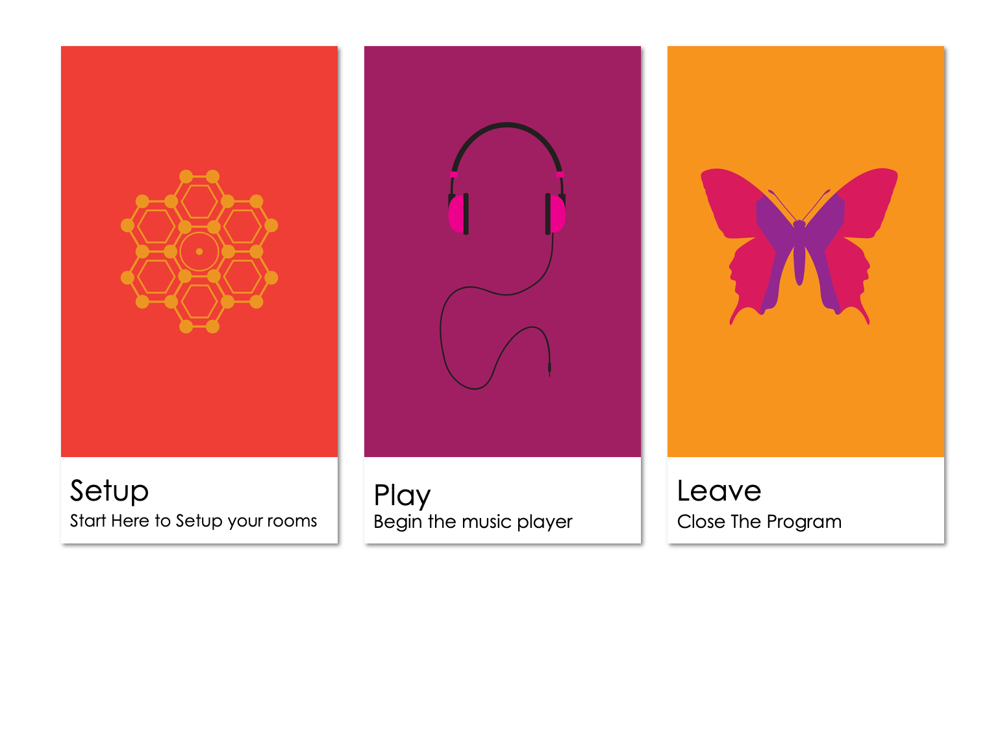

# SoundScapes

A Simple App for Linux, Windows and Mac that gives a GUI to play music from a particular genre using Machine Learning depending on where the user is.



I made this to be a free "radio" for our makerspace to serve calming music to our visitors and clients whenever they enter the space.

It saves and plays the music depending on the area that the user is in. It uses Machine Learning using Scikit Learn to determine the position of the user via indoor localization then uses the Sound Cloud Library to select a random song and play that song. 

It also comes with calming background images to accompany the music.

In Cae you want to make changes to the music playlist selection or Images, you can do so using the GUI

## Getting Started

These instructions will get you a copy of the project up and running on your local machine for development and testing purposes. See deployment for notes on how to deploy the project on a live system.

### Prerequisites

What things you need to install the software and how to install them

* Kivy
* Sound Cloud Library

### Installing

To install the prerequisites, you can go to their project pages to install them properly. The basic installation that I use is simply:

```
#Kivy needed to run GUI
sudo pip install kivy

#Sound Cloud Library, a third party package that downloads music from Sound Cloud's API while by passing some limitations
sudo pip install sclib
```

### Running the Program

To Run the Program, simply Clone the Repo and change directory to the repository's main file.

Then in the terminal type:

```
sudo python3 main.py
```

Below Is a picture showing the GUI Starting if everything has gone well.


### Learning the Rooms:

To Learn the Room and set the Genre

```
Give an example
```

### Playing Music

To Play Music, Just Press the Play Icon and the Player will automatically start

```
Give an example
```

## Deployment

To Deploy the System, i've been trying (Without success) to get it running on Android devices :(

Otherwise, the Windows Executable is available for download and is set to run on any windows machine.

I also have an IOS executable in the making.

## Built With

* [whereami](http://www.dropwizard.io/1.0.2/docs/) - Machine Learning Indoor Localization
* [sclib](https://maven.apache.org/) - Download Music
* [kivy](https://rometools.github.io/rome/) - Used to generate GUI 
* [bs4](https://www.crummy.com/software/BeautifulSoup/bs4/doc/) - Used to Scrape Web
* [pickle](https://docs.python.org/3/library/pickle.html) - Used to serialize object structures


## Authors

* **Mphatso Simbao** - *Initial work* 

## License

This project is licensed under the GNU GENERAL PUBLIC LICENSE

## Acknowledgments

* Pascal van Kooten
* Ian Murphy
